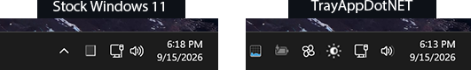
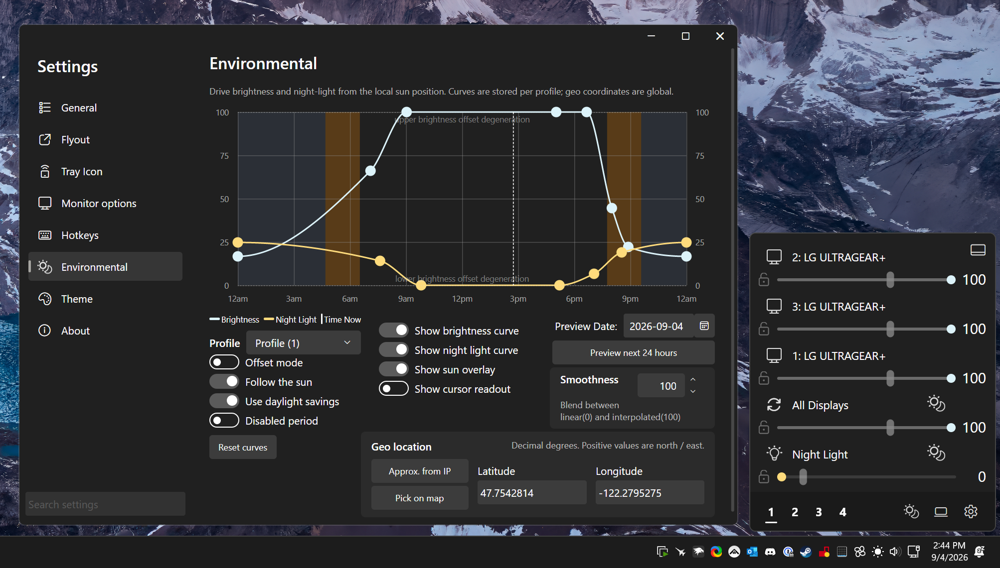
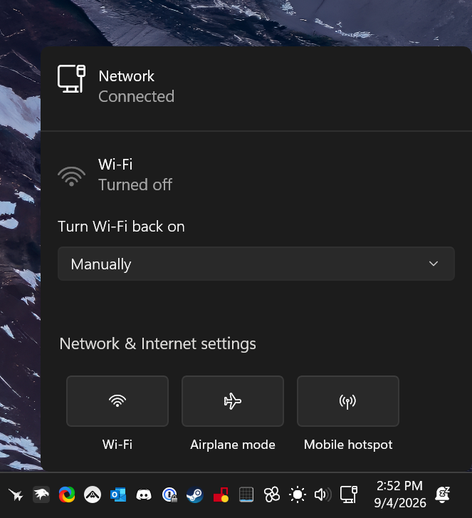
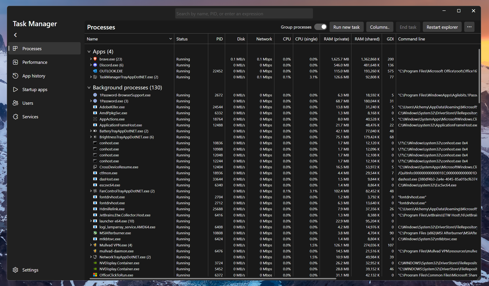
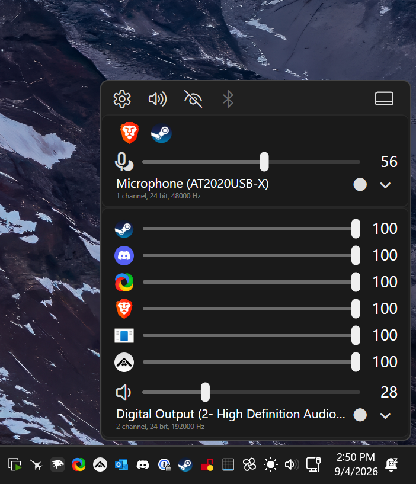

<h1 align="center">TrayAppDotNET&nbsp;</h1>

<em>A suite of Windows 11 apps focused around one of the most under-loved pieces of UX ever.</em>

## Overview
These are my projects for replacing, and adding to, the Windows 11 tray system apps. For the best effect, it's recommended to pair those apps which replace an existing Windows 11 counterpart, with [Windhawk's Taskbar Tray System Icon Tweaks Mod](https://windhawk.net/mods/taskbar-tray-system-icon-tweaks) in order to hide the stock OS tray icon(s).

  

### Installation

These projects are all portable executables, and they serve as their own installers. You can manage an app's installation by opening Settings -> About. 

All app settings are saved to `%LocalAppData%\TrayAppDotNET`.

Running an app in portable mode will extract a couple Skia rendering library files to the aforementioned user config folder. All other libraries and files are baked into the apps during compilation, including the .NET runtime.

#### Project status

These projects should all be considered to be in alpha. I personally use all of them without major issues, but there is still a lot that needs to be done. Also, some apps are much further along than others.

Without further ado, here is what currently exists:

---

<h3>BatteryTrayAppDotNET&nbsp;</h3>

---

<h3>BrightnessTrayAppDotNET&nbsp;</h3>

This app lets you control the *actual* brightness of external displays, as well as Windows brightness (laptops) and Windows Night Light.

I kept running into DDC failures with Twinkle Tray, and I'm not a fan of how much memory Electron uses. I took inspiration from the fluent layout it used, so many thanks to Xander Franfangos for that! BrightnessTrayAppDotNET was the first "major" app I started working on. There are quite a few features.

<strong>Features</strong>

  
* User profiles
* Windows Night Light integration
* Brightness synchronization
* Control disengagement
* Day/Night curve
	* Auto re-engage
	* Quick-swap
	* Disengage timer
	* Graphical curve editor
    * Obliquity compensation
* Robust DDC recovery and fast apply
* Windows brightness support
* Display management
	* Renaming
	* Brightness normalization
	* DDC tuning
* Mouse wheel tray icon
	* Works with touchpad
	* No global mouse hook
* Dynamic tray icon
	* Solar eclipse visual shows current brightness level

  

---

<h3>FanControlTrayAppDotNET&nbsp;</h3>

Not to be confused with the very popular "Fan Control" project. The former to me is a bit cumbersome to use, and I find it odd its not open source. As the author of Fan Control states, that project and this one are both essentially UX wrappers around LibreHardwareMonitor, and nothing more.

---

<h3>NetworkTrayAppDotNET&nbsp;</h3>

This is as simple as it gets. I've been fine with the old Windows Network flyout, so this little app just invokes that and keeps track of its tray icon status. One feature I did add is a quick access tray menu entry that lets you open an explorer shell (dark theme supported) directly to the classic network adapters panel.

  

---

<h3>TaskManagerTrayAppDotNET&nbsp;</h3>

A "reimplementation" of the Windows 11 Task Manager. The official Task Manager has become far too stuttery for me. While "fixing that", some extra bells and whistles were added.

<strong>Features</strong>

  
* Combined process + details view
	* Zoom + stretch
	* Dynamic sum totals
	* Multi-select
	* View options
	* Searchable columns
	* Column customization
* Enhanced search
	* Search saving
* Enhanced performance view
	* Preview graphs
	* Draggable device list
	* Live cursor graph hover
	* Physical memory layout
	* Single core metrics
* Background mode
* Modern tray icon with display modes

  

---

<h3>VolumeTrayAppDotNET&nbsp;</h3>

EarTrumpet users might find this familiar. I took inspiration from it in this design. I had originally modified EarTrumpet to show devices and app mixing from the bottom-up, to minimize mouse movement distance. Since that project seems to have been abandoned, I took a crack at the whole thing.

<strong>Features</strong>

* Dynamic flyout structure
* Recording device support
* Bluetooth management
* Device management
	* Renaming
	* Defaulting
	* Visibility
* Smooth peak meters
	* The visual indicator of the current volume level
* Touchpad scroll tray icon
	* No global mouse hook

  

---

All apps come with the following features:

* Flyout undocking (where applicable)
* Searchable settings (with fuzzing)
* Live theme customization
* Rebindable Hotkeys
* Update system
* Crash recovery
* Customizable tray menus (where applicable)

## Dev Environment

I use Visual Studio 2026 with this project. Here are the necessary tools to compile it yourself.

* Visual Studio Build Tools 17 with:
  * Desktop C++ environment
  * MSVC v143
  * Windows 11 SDK 10

## Misc Details

#### Launch Arguments

| Argument | Intended use | Behavior |
| --- | --- | --- |
| No arguments | User | Start the app normally under the crash watcher. |
| `--installer` or `--install-gui` | User | Open the one-page installer. Local installation is selected by default. Selecting system installation causes Windows to display a UAC prompt after Install is clicked. |
| `--install-headless <scope>` | User/script | Install without opening a window, print the result to the parent console when attached, then exit. System scope causes Windows to display a UAC prompt. |
| `--install <scope>` | User/script | Compatibility alias for `--install-headless <scope>`. |
| `--installlocal` | User/script | Install locally without opening a window, then start the installed instance. |
| `--installsystem` | User/script | Install system-wide without opening a window, display the Windows UAC prompt, then start the installed instance. |
| `--desktop-shortcut <true|false>` | User/script | Choose whether a headless install creates a desktop shortcut. The default is `false`. |
| `--start-menu-shortcut <true|false>` | User/script | Choose whether a headless install creates a Start Menu entry. The default is `true`. |
| `--uninstall <installDir> --scope <scope>` | App/Windows uninstall entry | Open the uninstaller for the supplied installation. Confirming a system uninstall causes Windows to display a UAC prompt. |
| `--uninstall-gui <installDir> --scope <scope>` | App/Windows uninstall entry | Alias for `--uninstall`. |
| `--uninstall-headless <scope>` | User/script | Uninstall without opening a window. System scope causes Windows to display a UAC prompt. |
| `--delete-settings <true|false>` | User/script | Choose whether `--uninstall-headless` also removes the application's settings. The default is `false`. |
| `--scope <scope>` | App helper | Select an installation for uninstall operations. Accepted values are `user`, `local`, `localappdata`, `system`, `programfiles`, `store`, and `windowsstore`. |
| `--watcher` | App helper | Run the crash watcher process. |
| `--monitored --watcher-pid <pid>` | App helper | Run the monitored app process owned by the watcher with the supplied watcher PID. |
| `--watcher-pid <pid>` | App helper | Supplies the watcher PID to a monitored app instance. |
| `--install-system --source <sourceExe> --build <buildNumber>` | App helper | Continue a system installation after Windows has displayed the UAC prompt, then write system uninstall and shortcut metadata. |
| `--sync-start-menu [--remove-scope <scope>]` | App helper | Reconcile all-user Start Menu shortcuts from a process started through the Windows UAC prompt. |
| `--uninstall-prepare --scope <scope>` | App helper | Remove shell integration and stop the installed process before the batch cleanup stage. For system scope, the owning batch is started through the Windows UAC prompt. |
| `--remove-scope <scope>` | App helper | Scope value consumed by `--sync-start-menu` when removing shortcuts for an uninstalling scope. |
| `--update-apply` | App helper | Apply a staged update after the running app exits. Windows displays a UAC prompt only when the installation directory requires elevation. |
| `--update-restart` | App helper | Restart the installed app after update commit or rollback, then clean the staging directory. This process is deliberately not elevated. |

#### Build Architecture

Each app is written in .NET 10 with Avalonia 12 and compiled with Native AOT. While the apps do share a common framework, they are totally independent from each other. This makes it much simpler to distribute them and manage privileges, and keeps each app isolated from one another in case of instability or performance issues. Memory overhead of this and these apps has been taken into account, especially given they are background applications, and care has been taken to make sure they are memory efficient. The entire suite uses roughly the same amount of RAM as one medium-sized electron app.

There is a small set of embedded libraries which amount to the Skia rendering backend Avalonia uses. These are embedded instead of compiled from source straight in because they're large enough in my opinion to warrant Windows re-using them via shared working set memory, to lower the overall memory footprint from running multiple of these tray apps together. 

#### AI Usage

I use frontier LLM's *heavily* in this project. Disclaimer: I am actually a software engineer; I do actually read and review what gets written, as well as use my fingers to write code myself sometimes, not just prompts. What I am not about to do is spend 6 months doing grunt work on a thousand Windows API's just for one feature to barely work, or another 2 months refactoring the entire codebase for any number of reasons. With that said, all the architecture and design is mine. I allow LLMs complete reign over spam generating test code since any broken tests will inevitably be cleaned by an LLM, and the more coverage the merrier. Beyond this, I'm fairly loose with scrutinizing code comments unless its something I *really* care about. I generally keep a defined stylesheet to minimize the amount of garbage.

If you look around the codebase you'll see some markdown files for LLM agents to assist them with context, mechanisms, etc. If you want to try and work on something in here with AI, I'd recommend reading at least the AGENTS.md file yourself. There are some acronyms in there, among other things, that make it a bit easier to communicate with your LLM of choice.

#### Versions

These projects don't use semver. There is no API contract to uphold, and I would prefer not assigning bizzare meaning to semvers that would cause them to look like they're flying all over. The TrayAppDotNET version increments every single release. The individual app versions incremenet only when they themselves have a new release. If an app is not scheduled to have a new version, or has no changes, the release generator will go grab the previous release artifact for that app and re-publish it. This is done so releases remain consistent and there are no tag spiderwebs.

#### Project Name - "Why TrayAppDotNET?"

I cooked up the network app first, which amounted to little more than a single chat message to Claude to whip up a WPF tray icon and a Windows shell call. I couldn't imagine a real name that wouldn't be outlandishly indescriptive so I called it what it was; "NetworkTrayAppWPF". I stuck with this scheme since it lets someone know immediately that these different apps are all from the same project, and because, again, they're quite descriptive. It's also quick and handy to refer to them by their acronyms.

## Translation

This project uses [Weblate](https://hosted.weblate.org/projects/feishin/) for translations. If you would like to contribute, please visit the link and submit a translation.

## License

[GNU General Public License v3.0](https://github.com/alchemyyy/TrayAppDotNET/blob/main/LICENSE)
